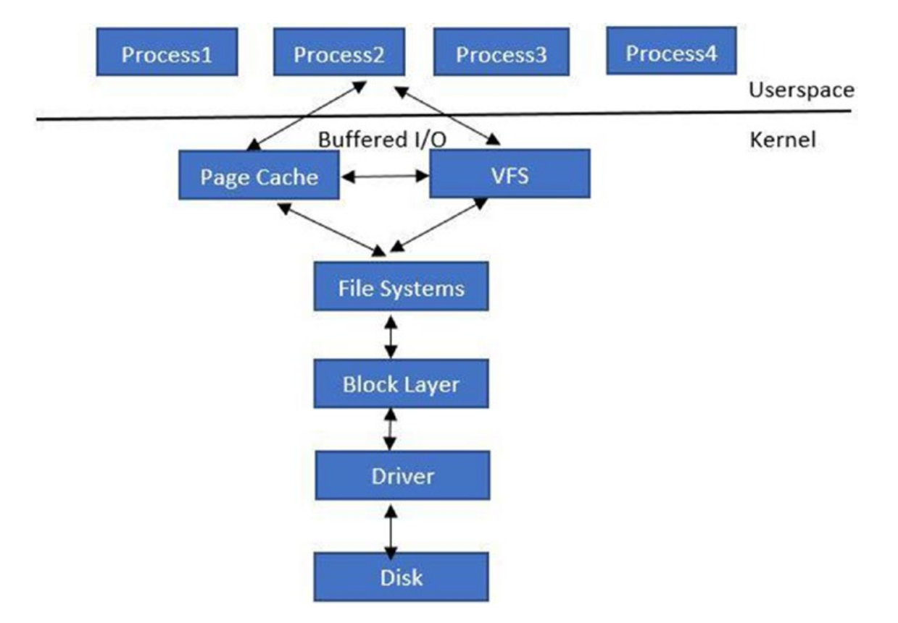
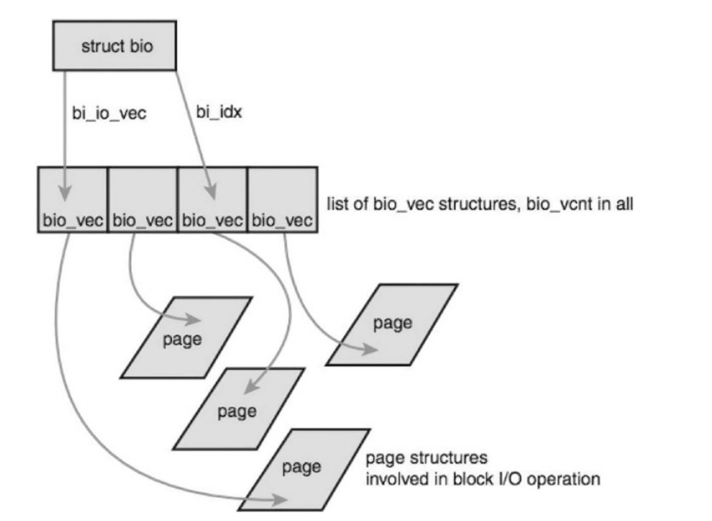

## 概述

Block I/O cgroup 的目的有两个:

- 为单个 cgroup 提供公平性:使用称为完全公平排队（completely fair queuing）的调度程序。
- 是否阻止 I/O 限制:对每个 cgroup 的数据块 I/O(字节数和 IOPS)实施配额。

## 工作原理

Linux block I/O 的工作原理。下图是 Block I/O 请求如何通过用户空间流向设备的高级框图：



应用程序通过文件系统或内存映射文件发出读/写请求。在任何一种情况下,请求都会命中页面缓存(用于缓存文件数据的内核缓冲区)。对于基于文件系统的调用,虚拟文件系统 (VFS) 处理系统调用底层注册的文件系统。 

文件系统将请求传递给块设备驱动程序,后者将请求传递给 Block I/O 调度程序。

块 I/O 调度程序将请求传递给底层块设备驱动程序。

下一层是构建实际 I/O 请求的块层（block layer）。 块层中有三种重要的数据结构:

- Request_queue： 单队列架构是指每个设备只有一个请求队列。在这个队列中，块层与 I/O 调度器一起对请求进行排队。设备驱动程序排空请求队列，并将请求提交给实际设备。

- Request: request 表示要传送到 I/O 设备的单个 I/O 请求。request 由 bio 结构体列表组成。

- bio: bio 结构是块 I/O 的基本容器。内核中是 bio 结构体。在 `<linux/bio.h>` 中定义, 此结构体将正在进行的(活动) 的块 I/O作表示为 Segment 列表。Segment 是内存中连续的缓冲区块。



bio 结构体以分段列表的形式表示正在执行（激活）的块 I/O 操作

bio_vec表示特定段,并具有指向在特定偏移处保存块数据的页面的指针。

### blkcg 结构体

```c
struct blkcg {
  struct cgroup_subsys_state css;
  spinlock_t lock;
  struct radix_tree_root blkg_tree;
  struct blkcg_gq __rcu *blkg_hint;
  struct hlist_head blkg_list;
  struct blkcg_policy_data *cpd[BLKCG_MAX_POLS];
  struct list_head all_blkcgs_node;
  #ifdef CONFIG_CGROUP_WRITEBACK
  struct list_head cgwb_list;
  refcount_t cgwb_refcnt;
  #endif
};
```

blkcg 结构体表示块 I/O cgroup。每个数据块 I/O cgroup 都映射到一个请求队列。

### blkcg_gq 结构体

```c
/* association between a blk cgroup and a request queue 翻译*/
struct blkcg_gq {
  /* Pointer to the associated request_queue */
  struct request_queue *q;
  struct list_head q_node;
  struct hlist_node blkcg_node;
  struct blkcg *blkcg;
  /* Each blkg gets congested separately and the congestion state is
  * propagated to the matching bdi_writeback_congested.
  */
  struct bdi_writeback_congested *wb_congested;
  /* all non-root blkcg_gq's are guaranteed to have access to  parent */
  struct blkcg_gq *parent;
  /* request allocation list for this blkcg-q pair */
  struct request_list rl;
  /* reference count */
  atomic_t refcnt;
  /* is this blkg online? protected by both blkcg and q locks */
  bool online;
  struct blkg_rwstat
  struct blkg_rwstatstat_bytes;
  stat_ios;
  struct blkg_policy_data*pd[BLKCG_MAX_POLS];
  struct rcu_headrcu_head;
  atomic_t use_delay;
  atomic64_t delay_nsec;
  atomic64_t delay_start;
  u64  last_delay;
  int last_use;
};
```


