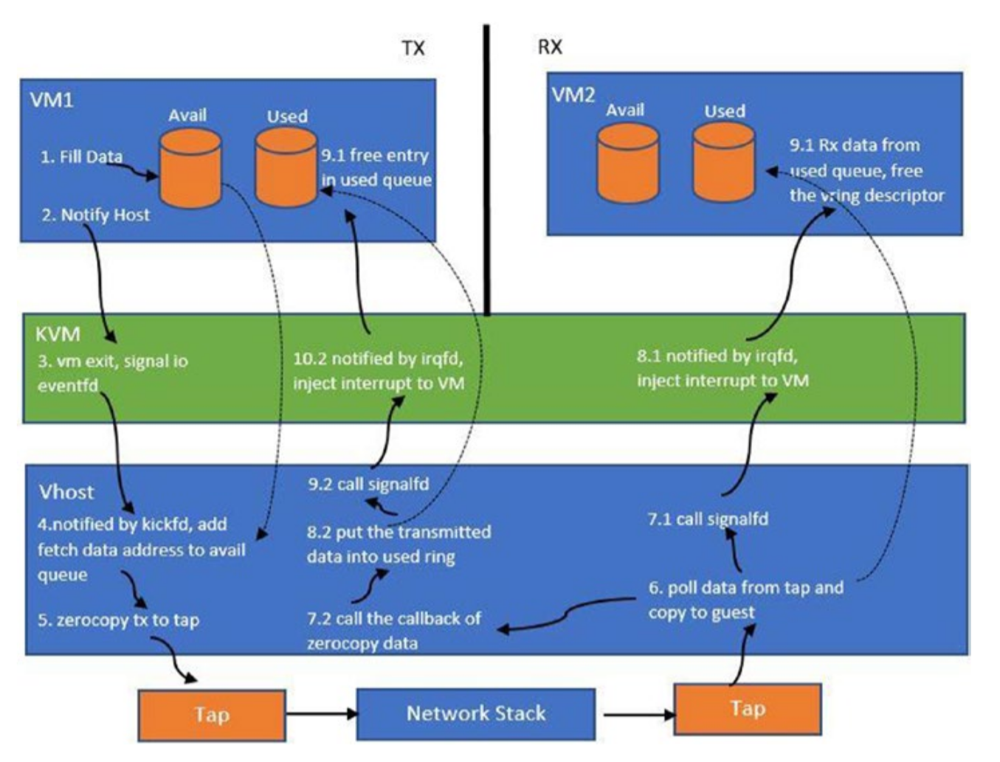

### eventfd 简介

eventfd 是 Linux 内核提供的一个事件通知机制, 它使用文件描述符来通知进程事件的发生。

eventfd 可以用于进程间通信(IPC), 也可以用于进程内通信。

eventfd 的实现原理是, 当一个进程调用 eventfd_create 函数创建一个 eventfd 文件描述符时, 内核会在内存中创建一个 eventfd 结构体, 并返回一个文件描述符。

消费者线程可以通过 epoll_wait 等待 epoll 对象。一旦生产者线程写入 FD,epoll 机制将通知消费者(同样取决于边缘或级别触发器)该事件。

主机使用 eventfd 将数据从 guest 发送到主机,并使用 irqfd 接收从主机到 guest 的中断。

虚拟主机 I/O 线程监视 eventfd。每当 Guest 发生 I/O 事件时, Guest 的 I/O 线程都会收到通知,它必须从 tx 队列中耗尽缓冲区。

与 ioeventfd 类似,有一个 irqfd。QEMU 用户空间还为 guest 注册此 (irqfd) FD。来宾驱动程序侦听对这些 FD 的更改。