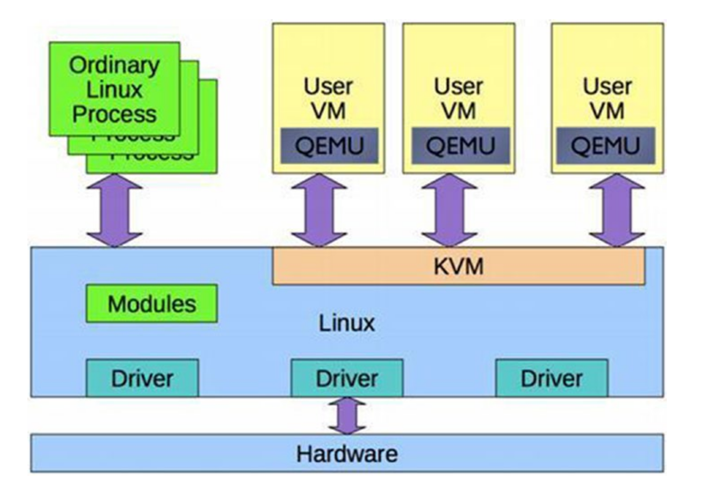
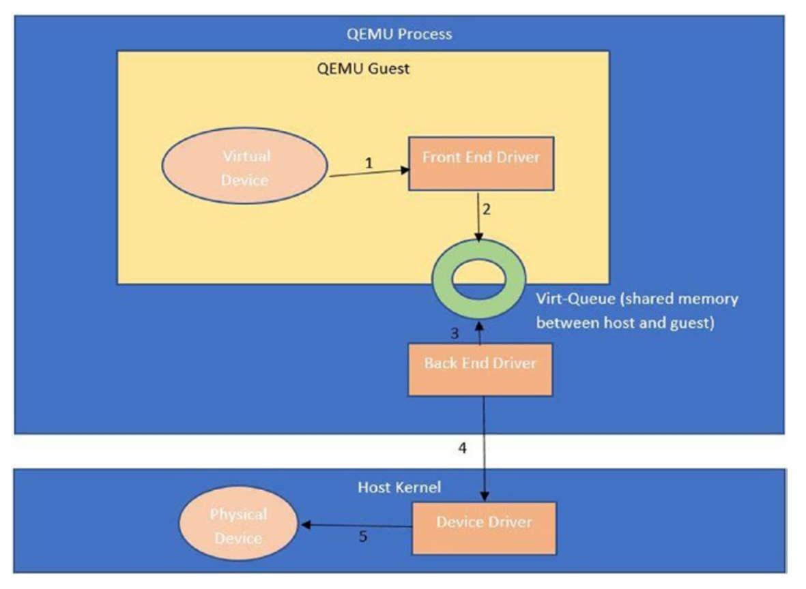

QEMU 作为用户进程运行并处理 KVM 内核模块。

它使用 vt-x 扩展从内存和 CPU 的角度为 Guest 提供隔离的环境。QEMU 进程拥有客户机 RAM, 并且通过文件进行内存映射,或者是匿名的。VCPU 计划在物理 CPU上。

### 虚拟机管理程序与 QEMU 交互

正常进程和 QEMU 进程之间的主要区别在于在这些线程上执行的代码。对于 guest,由于它是虚拟机, 因此代码将执行软件 BIOS 和操作系统。

下图展示 QEMU 如何与虚拟机管理程序交互：

QEMU 还为 I/O 专门提供了一个单独的线程。 此线程运行事件循环,并基于非阻塞机制。它为 I/O 注册文件描述符。 QEMU 可以使用半虚拟化驱动程序(如 virtio)为客户机提供 virtio 设备,例如用于块设备的virtio-blk 和用于网络设备的 virtio-net。

QEMU 进程中的 guest 实现前端驱动程序,而 host 实现后端驱动程序。前端和后端驱动程序之间的通信通过称为 virt queues 的专用数据结构进行。

首先将源自 guest 的任何数据包放入 virt queue, 并通过 hypercall 通知 host 端驱动程序,以耗尽数据包,以便对设备进行实际处理。

此数据包流可能有两种变体,如下所示:

1. QEMU 接收来自 guest 的数据包,然后将其推送到 host 上的后端驱动程序。典型例子是 virtio-net。

2. 来自 guest 的数据包通过所谓的 vhost driver 直接到达 host。这绕过了 QEMU 层,并且相对较快。