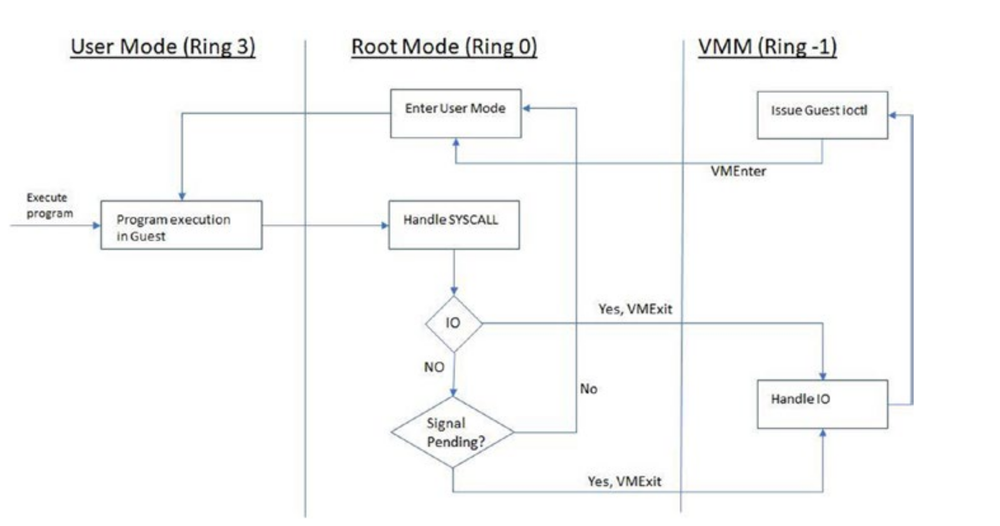

Intel 的虚拟化技术称为 Intel VT-x, 是 Intel 的虚拟化技术, 全称是 Intel Virtualization Technology for x86。

## 背景

### 虚拟机性能损耗问题

对比程序和操作系统如何与 CPU 交互,以及 VM 中的程序如何与 CPU 交互：

- 对于主机上运行的常规程序,作系统将程序指令转换为由 CPU 执行的 CPU 指令。

- 对于虚拟机,为了在虚拟机中运行程序,来宾作系统将程序指令转换为虚拟 CPU 指令,然后虚拟机管理程序将这些指令转换为物理 CPU 的指令。

问题识别 - 对于 VM, 程序指令被转换了两次：

1. 程序指令被翻译成虚拟 CPU 指令
2. 虚拟 CPU 指令被翻译成物理 CPU 指令

这会导致较大的性能开销并降低虚拟机的速度。CPU 虚拟化与 vt-x 功能一样,能够将 CPU 的全部能力完全抽象到虚拟机,以便 VM 中的所有软件都可以在不影响性能的情况下运行;它像在专用 CPU 上一样运行。

### 虚拟化漏洞问题

vt-x 还解决了 x86 指令体系结构无法虚拟化的问题。

vt-x 通过设计填补虚拟化漏洞来简化 VMM 软件: 

- 环压缩: vt-x 通过在 ring 0 中直接运行 guest 操作系统来避免这种情况

- 非捕获指令： vt-x 通过在环 0 中运行 guest 操作系统来解决此问题,其中 POPF 等指令可以在 Ring -1 中运行的虚拟机管理程序中捕获到

- 过度捕获： 如果没有 vt-x,所有敏感和特权指令都会捕获到 ring 0 中的虚拟机管理程序中。在 vt-x 中,这将变得可配置

## 运行模式

vt-x 添加了另外两种模式：

1. 非根模式（non-root mode）：在 ring -1 中， 是 VMM 运行的位置

2. 根模式（root mode）： 在环 0 中， 是 guest 操作系统的运行位置

例子, 假设一个程序正在 VM 中执行,并且在执行过程中,它对 I/O 进行了系统调用。 

- 用户空间中的 guest 程序在 ring 3 中执行。
- 当程序进行 I/O 调用(即系统调用)时,这些指令将在 guest 操作系统内核级别(ring 0) 执行。
- guest 操作系统本身无法处理 I/O 调用, 因此它会将其委托给 VMM(ring -1)。

概念：

- VMExit: 当执行从 ring 0 返回到 ring -1 时,称为 VMExit,
- VMEntry: 当执行从 ring -1 返回到 ring 0 时,称为 VMEntry。

