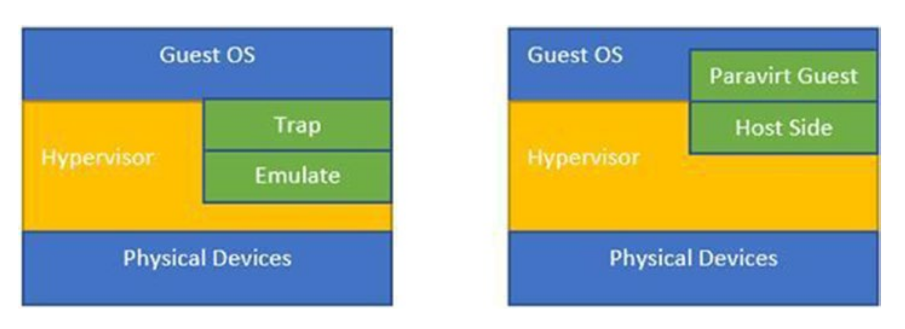

## 概述

IO 虚拟化通常有两种模式:

- 完全虚拟化
- 半虚拟化

### 完全虚拟化

通过完全虚拟化, guest不知道它正在虚拟机管理程序上运行,并且 guest O/S 不需要任何更改即可在虚拟机管理程序上运行。

每当 guest 进行 I/O 调用时,它们都会被困在虚拟机管理程序中,而虚拟机管理程序会在物理设备上执行 I/O。

### 半虚拟化

在这种情况下, guest 操作系统会意识到它正在虚拟化环境中运行,并且特殊驱动程序会加载到 guest 中以处理 I/O。 

对 I/O 的系统调用将替换为 hypercalls。

下图展示了半虚拟化和完全虚拟化之间的区别：

在半虚拟化方案中, guest 端驱动程序称为前端驱动程序, host 端驱动程序称为后端驱动程序。

Virtio 是实现半虚拟化驱动程序的虚拟化标准。Virtio 驱动程序分为两部分：

- 前端驱动程序

  在 guest 中运行，基于 Virtio 标准实现的, 并且前端驱动程序知道它们正在虚拟环境中运行

  Guest 上的前端驱动程序实现了一组通用的接口,如 Virt io 标准所述。当必须从客户机中的进程进行 I/O 调用时,该进程将调用前端驱动程序 API,驱动程序通过 virtqueue(虚拟队列)将数据包传递给相应的后端驱动程序。

- 后端驱动程序

  在 host 中运行， 可以通过两种方式工作:

  1. QEMU 仿真： 这意味着 QEMU 通过来自用户空间的系统调用来模拟设备调用。这意味着 hypervisor 允许用户空间 QEMU 程序进行实际的设备调用。

  2. 类 vhost 的机制： 避免 QEMU 仿真,并由 Hypervisor 内核进行实际的设备调用

前端和后端驱动程序的这种工作机制有助于实现高性能的网络和磁盘操作,并且是半虚拟化享有大部分性能优势的原因。

### virtqueue

前端和后端 Virtio 驱动程序之间的通信由 virtqueue 抽象完成。

virtqueue 提供了一个 API 进行交互,允许它对缓冲区进行排队和出队。

根据驱动程序类型,他们可以使用零个或多个队列：

- 网络驱动程序： 使用两个 virtqueues:一个队列用于请求,另一个用于接收数据包。

- Virtio 区块驱动程序： 只使用一个 virtqueue

